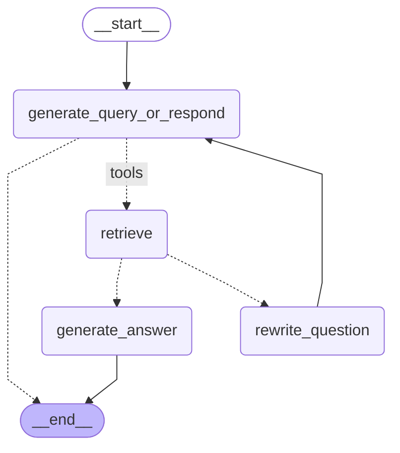

# RAG Workflow Diagram

## Interactive Mermaid Diagram

## How to View

### Option 1: GitHub
- Push this file to GitHub
- GitHub automatically renders Mermaid diagrams

### Option 2: VS Code
1. Install "Markdown Preview Mermaid Support" extension
2. Open this file
3. Press `Ctrl+Shift+V` (preview)

### Option 3: Online Viewer
1. Go to https://mermaid.live
2. Paste the code from `rag_workflow.mermaid`
3. View and export as PNG/SVG

### Option 4: LangSmith
- Your workflow traces in LangSmith automatically show this diagram!

## Graph Structure

**Nodes:**
- `__start__` - Entry point
- `generate_query_or_respond` - LLM router (decides to answer or retrieve)
- `retrieve` - Document retrieval from ChromaDB
- `grade_documents` - Quality check for relevance
- `generate_answer` - Final answer generation
- `rewrite_question` - Query improvement
- `__end__` - Exit point

**Flow:**
1. Question enters at START
2. LLM router decides: answer directly or retrieve docs
3. If retrieve: get docs from vector store
4. Grade docs for relevance
5. If relevant: generate answer
6. If not relevant: rewrite query and try again
