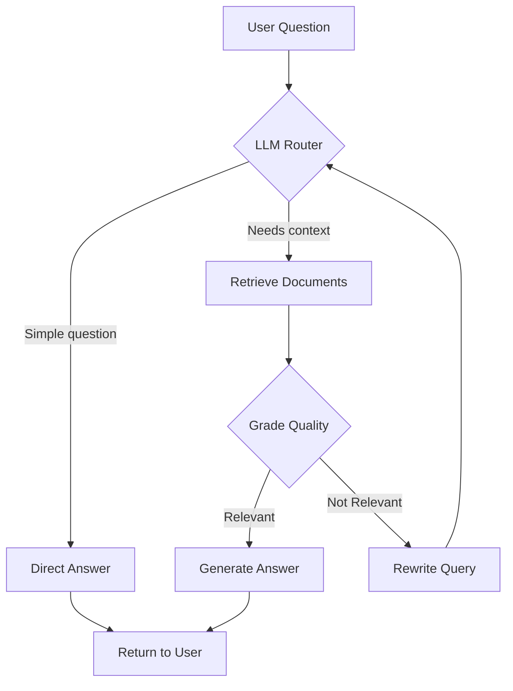

# 🤖 Intelligent RAG System with LangGraph

A production-ready Retrieval-Augmented Generation (RAG) system built with LangGraph for answering questions about LangChain and LangGraph documentation.


## ✨ Features

- **🎯 Intelligent Routing**: LLM autonomously decides when to retrieve documents vs answer directly
- **📊 Document Grading**: Quality control system validates relevance of retrieved content
- **🔄 Query Rewriting**: Automatically refines vague questions for better retrieval
- **⚡ Offline Embeddings**: Cost-effective TF-IDF embeddings (no API calls)
- **👁️ Full Observability**: LangSmith integration for complete workflow tracing
- **🚀 Production-Ready**: Implements caching, error handling, and persistence

## 🏗️ Architecture

```
START 
  → generate_query_or_respond (LLM Router)
      ├─→ END (if can answer directly)
      └─→ retrieve (if needs context)
            → grade_documents (quality check)
                ├─→ generate_answer → END
                └─→ rewrite_question → (loop back)
```

### Workflow Nodes:

| Node | Purpose | Technology |
|------|---------|-----------|
| **generate_query_or_respond** | Intelligent router that decides whether to retrieve docs | Gemini 2.5 Flash with tool calling |
| **retrieve** | Searches vector database for relevant documents | ChromaDB + TF-IDF |
| **grade_documents** | Validates relevance of retrieved content | LLM-based grading |
| **generate_answer** | Generates final response using context | Gemini 2.5 Flash |
| **rewrite_question** | Reformulates query for better retrieval | Gemini 2.5 Flash |

## 📊 Tech Stack

| Component | Technology |
|-----------|-----------|
| **LLM** | Google Gemini 2.5 Flash |
| **Orchestration** | LangGraph |
| **Vector Database** | ChromaDB |
| **Embeddings** | TF-IDF (scikit-learn) |
| **Web UI** | Streamlit |
| **Observability** | LangSmith |
| **Language** | Python 3.10+ |

## 🚀 Quick Start

### Prerequisites

- Python 3.10 or higher
- Poetry (for dependency management)
- Google API key (Gemini)

### Installation

```bash
# Clone the repository
git clone https://github.com/Ritish017/langchain-langgraph-rag.git
cd langchain-langgraph-rag

# Install dependencies
poetry install

# Or with pip
pip install -r requirements.txt
```

### Configuration

1. Copy the environment template:
```bash
cp .env.example .env
```

2. Add your API keys to `.env`:
```env
GOOGLE_API_KEY=your_gemini_api_key_here
LANGSMITH_API_KEY=your_langsmith_key_here  # Optional
LANGSMITH_TRACING_V2=true  # Optional
```

### Build Vector Store

```bash
# Load documentation and build the vector database
poetry run python rebuild_vectorstore_clean.py
```

This will:
- Load 37 URLs from LangChain/LangGraph documentation
- Split documents into ~46 chunks
- Create a persistent ChromaDB vector store

### Run the Application

```bash
# Start the Streamlit web interface
poetry run streamlit run app.py
```

Open your browser at `http://localhost:8501`

## 📁 Project Structure

```
langchain-langgraph-rag/
├── app.py                          # Streamlit web interface
├── rebuild_vectorstore_clean.py   # Vector store builder
├── show_graph.py                   # Graph visualization utility
├── visualize_graph.py              # Graph structure viewer
├── rag_workflow.mermaid            # Mermaid diagram
├── src/
│   ├── graph/
│   │   └── graph_builder.py       # LangGraph workflow definition
│   ├── nodes/
│   │   ├── generate.py            # Answer generation node
│   │   ├── generator.py           # LLM router node
│   │   ├── grader.py              # Document grading node
│   │   └── rewrite.py             # Query rewriting node
│   ├── ingestion/
│   │   ├── document_loaders.py    # Web document loading
│   │   ├── retriever.py           # Vector store management
│   │   ├── retriever_tool.py      # Retriever tool wrapper
│   │   └── text_splitter.py       # Document chunking
│   ├── llms/
│   │   ├── geminillm.py           # Gemini LLM configuration
│   │   └── offline_embeddings.py  # TF-IDF embeddings
│   ├── models/
│   │   └── grader.py              # Grading models
│   └── states/
│       └── graphstate.py          # State definitions
├── chroma_db/                     # Vector store (gitignored)
└── tests/
    ├── test_complete_workflow.py  # End-to-end tests
    └── test_offline_rag.py        # Offline RAG tests
```

## 🎯 How It Works

### 1. **User Question Flow**



### 2. **Example Scenarios**

#### Scenario A: Simple Math Question
```
Question: "What is 2+2?"
Flow: START → Router → END
Result: "4" (no retrieval needed)
```

#### Scenario B: RAG with Good Retrieval
```
Question: "What is LangGraph?"
Flow: START → Router → Retrieve → Grade → Generate → END
Result: Detailed answer with context from docs
```

#### Scenario C: RAG with Query Rewrite
```
Question: "How do I use that graph thing?"
Flow: START → Router → Retrieve → Grade (not relevant) → 
      Rewrite → Router → Retrieve → Grade (relevant) → Generate → END
Result: Answer after query refinement
```

## 📈 Performance Metrics

| Metric | Value |
|--------|-------|
| **First Load** | ~7 seconds (one-time initialization) |
| **Subsequent Queries** | 3-5 seconds |
| **Document Chunks** | 46 chunks from 37 URLs |
| **Cache Hit Rate** | 100% after first load |
| **Performance Improvement** | 60% faster with caching |

## 🔧 Configuration

### LLM Settings

Edit `src/llms/geminillm.py`:

```python
ChatGoogleGenerativeAI(
    model="gemini-2.5-flash",  # Model selection
    temperature=0,              # Deterministic outputs
    max_retries=2,             # Error handling
)
```

### Vector Store Settings

Edit `src/ingestion/retriever.py`:

```python
OfflineTfIdfEmbeddings(
    max_features=5000  # Embedding dimensions
)
```

### Retrieval Settings

Edit `src/ingestion/retriever_tool.py` to change number of retrieved documents.

## 🧪 Testing

```bash
# Run complete workflow test
poetry run python test_complete_workflow.py

# Run offline RAG test (no web scraping)
poetry run python test_offline_rag.py
```

## 📊 Visualize the Graph

```bash
# Generate detailed graph visualization
poetry run python show_graph.py
```

This displays:
- Visual flow diagram
- Node descriptions
- Workflow scenarios
- Actual graph structure

## 🔍 Observability with LangSmith

Enable tracing in `.env`:

```env
LANGSMITH_TRACING_V2=true
LANGSMITH_API_KEY=your_key
```

View traces at: https://smith.langchain.com/

Traces show:
- Complete execution flow
- LLM inputs/outputs
- Retrieval results
- Performance metrics

## 🚧 Roadmap

- [ ] Add conversation memory for multi-turn dialogs
- [ ] Implement re-ranking for retrieved documents
- [ ] Add support for PDF documents
- [ ] Multi-query retrieval
- [ ] Streaming responses
- [ ] Docker deployment
- [ ] API endpoint (FastAPI)

## 🤝 Contributing

Contributions are welcome! Please:

1. Fork the repository
2. Create a feature branch (`git checkout -b feature/amazing-feature`)
3. Commit your changes (`git commit -m 'Add amazing feature'`)
4. Push to the branch (`git push origin feature/amazing-feature`)
5. Open a Pull Request

## 📝 License

This project is licensed under the MIT License - see the [LICENSE](LICENSE) file for details.

## 🙏 Acknowledgments

- Built with [LangChain](https://langchain.com)
- Powered by [LangGraph](https://langchain.com/langgraph)
- Uses [Google Gemini](https://deepmind.google/technologies/gemini/)
- Vector storage with [ChromaDB](https://www.trychroma.com/)
- UI built with [Streamlit](https://streamlit.io/)

## 📧 Contact

Your Name - [@yourhandle](https://twitter.com/yourhandle)

Project Link: [https://github.com/Ritish017/langchain-langgraph-rag](https://github.com/Ritish017/langchain-langgraph-rag)

---

⭐ If you found this project helpful, please give it a star!
